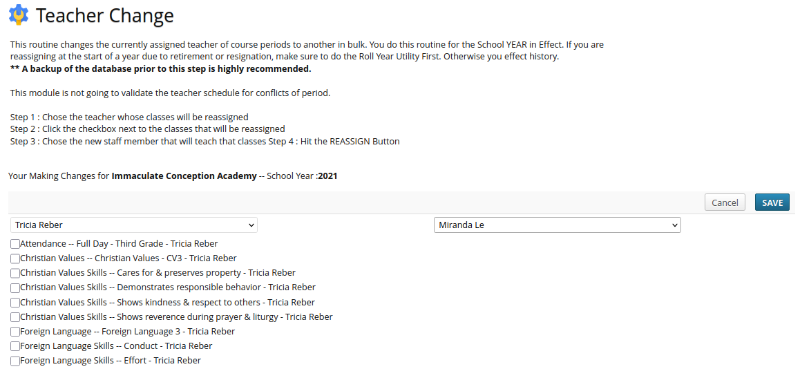
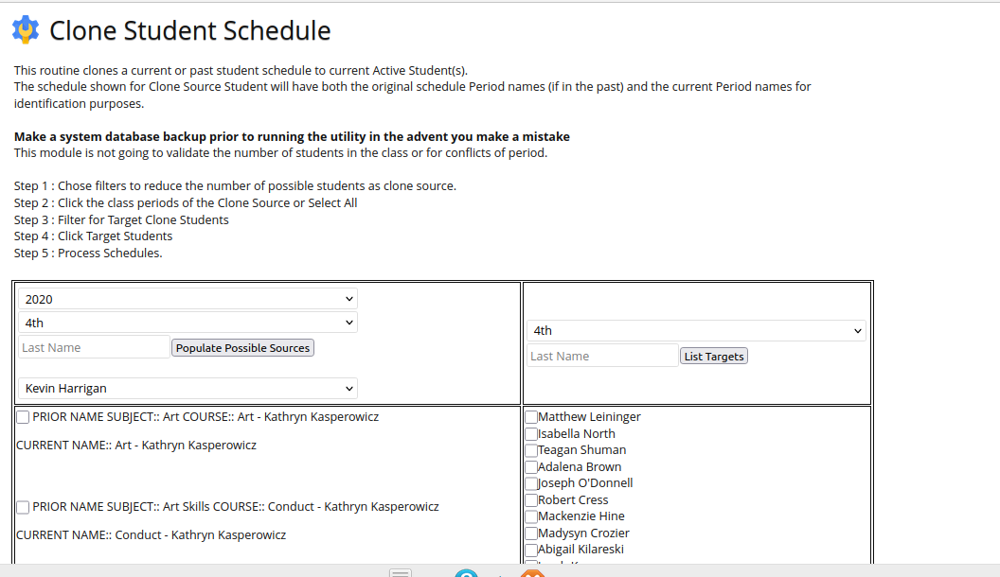

Admin Utilites Module
==============================

Version 1.0 - Sept, 2021

Author Gregory J. Forkin, Doc STEM

License MIT

DESCRIPTION
-----------
This module adds very much needed utilities to the Rosario SIS system for the Administrators.

Teacher Change Utility
----------------------

	- Teacher Change Module : Change the teacher of classes from one staff member to another in bulk... Really needed when a teacher retires to reassign their classes to new teachers.
	- If your school does grading by standards, you would manually have to update a few hundred classes for the skills.

Class Scheduling Cloner Utility
--------------------------------------
	- Create a clone of one students schedule to another student or a group of other Active students.
	- Pull historical schedules and have them convert to the current year Period Courses with proper Teacher and Period number.

### INSTALL
-------
Copy the `Utilities/` folder (if named `Utilities-master`, rename it) and its content inside the `modules/` folder of RosarioSIS.

Go to _School Setup > School Configuration > Modules_ and click "Activate".

Requires RosarioSIS 5.5+  -- Say Hey to Francois
